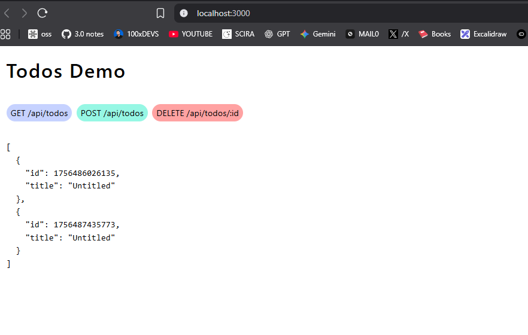
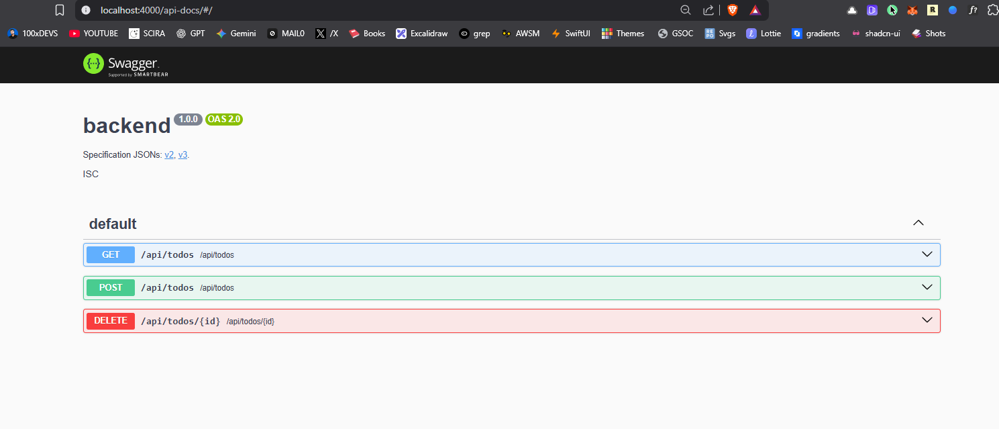

# Auto-TanstackQuery-Hooks

## Screenshots DEMO








# TRULY OPEN SOURCE, CAN BE MODIFIED TO PERSONAL USE !!

## What this app is ??
- Next.js frontend (App Router) + Express backend (TypeScript)
- `express-oas-generator` observes API traffic and writes `openapi.yaml`
- Orval generates a typed client + TanStack Query hooks from `openapi.yaml`
- Next.js rewrites `/api/*` to the backend, so the frontend calls your backend without CORS

## Why use Orval-generated hooks (vs writing hooks manually)
1. Strong types: request/response types come from the OpenAPI spec.
2. Fewer bugs: compile-time checks for params/bodies.
3. Less boilerplate: hooks, keys, and clients scaffolded for you.
4. Consistency: every endpoint follows the same patterns.
5. Faster iteration: change spec → regenerate → use.
6. Autocomplete: endpoints, params, and return types.
7. Tanstack Query integration: caching, refetch, errors included.
8. Centralized changes: update spec once for all consumers.
9. Easier onboarding: predictable, discoverable API surface.
10. Scale-ready: large APIs stay manageable as they grow.

## Repo layout
- `backend/` Express server (`tsx server.ts`)
- `openapi.yaml` OpenAPI spec (auto-written by backend after requests)
- `orval.config.ts` Orval configuration
- `src/api/` Generated client and hooks (`todoApi.ts`, `todoApi.schemas.ts`)
- `app/` Next.js app (App Router)

## Prerequisites
- Node 18+ (Node 22 used here)

## Install
```bash
npm install
cd backend && npm install && cd ..
```

## Run
- Backend (port 4000):
```bash
cd backend
nd   # alias for: npm run dev
```
- Frontend (port 3000):
```bash
nd   # alias for: npm run dev
```

## Development flow
1) Start backend (port 4000) and frontend.
2) Exercise endpoints (via UI or script) so `express-oas-generator` writes/updates `openapi.yaml`.
   - Example endpoints included:
     - Users (optional): `/api/users` (GET/POST) [can be commented]
     - Todos (demo): `/api/todos` (GET/POST), `/api/todos/:id` (DELETE)
3) Regenerate client & hooks from the spec:
```bash
npx orval --config orval.config.ts
```
4) Use the generated hooks in the frontend:
```tsx
import { useGetApiTodos, usePostApiTodos, useDeleteApiTodosId } from "@/src/api/todoApi";
```

## Useful commands
- Start backend: `cd backend && nd`
- Start frontend: `nd`
- Regenerate hooks: `npx orval --config orval.config.ts`
- Optional: Add a script to auto-hit endpoints for spec updates (see `backend/scripts/record-spec.ts` idea).

## Next.js → Backend rewrite (no CORS)
`next.config.ts`:
```ts
export default {
  async rewrites() {
    return [{ source: "/api/:path*", destination: "http://localhost:4000/api/:path*" }];
  },
};
```

## Notes
- `openapi.yaml` updates only after the backend sees real requests for new routes.
- Run Orval after spec changes.
- Generated code lives in `src/api/`; do not edit it manually.

## Project structure
```text
my-orval-app/
  app/
    layout.tsx
    page.tsx
    providers.tsx
    globals.css
  backend/
    server.ts
    package.json
  public/
    frontend.png
    swagger.png
  src/
    api/
      todoApi.ts
      todoApi.schemas.ts
  openapi.yaml
  orval.config.ts
  next.config.ts
  README.md
```

## Swagger/OpenAPI docs
- With the backend running, open `http://localhost:4000/api-docs` to view interactive Swagger UI.
- The spec (`openapi.yaml`) is generated/updated after endpoints are hit.

## How `openapi.yaml` works (and how to regenerate everything)
- The backend writes `openapi.yaml` automatically after you exercise endpoints at runtime.
- If you delete `openapi.yaml` and `src/api/*`, you can fully regenerate:
  1) Start backend and hit endpoints (via UI or script) so the generator rewrites `openapi.yaml`.
  2) Regenerate client/hooks with Orval.

### Commands
```bash
# Start backend (port 4000)
cd backend && npm run dev

# (In another terminal) Start frontend
npm run dev

# After hitting endpoints, (re)generate client/hooks
npx orval --config orval.config.ts

# Optional: watch mode
npx orval --config orval.config.ts --watch
```
